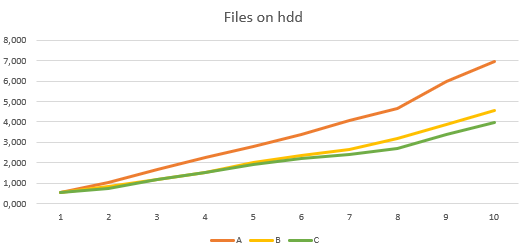
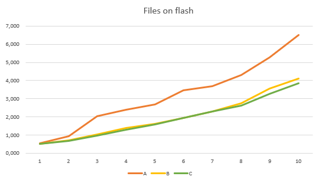

# Operating Systems Course Project

1. [Project Metadata](#project-metadata)
2. [Project Description](#project-description)
3. [Key Features](#key-features)
4. [Build & Execution](#build--execution)
5. [Performance Results](#performance-results)
   - [Flash Storage](#flash-storage-performance)
   - [HDD Performance](#hdd-performance)
   - [Summary](#compact-performance-results)
6. [Technologies Used](#technologies-used)
7. [Project Summary](#project-summary)


## Project Metadata
**Author:** Dudolin D.A., Group UIS-312  
**Variant:** 39  
**Supervisor:** Varfolomeev V.A.  

## Project Description
A program to find words with 3+ consecutive consonants in text files. Supports three modes:  
- Single-threaded (A)  
- Multi-threaded (B)  
- Multi-threaded with priority (C)  

## Key Features
- Processes up to 10 files simultaneously  
- Validates file uniqueness and existence  
- Measures execution time  
- Supports different storage devices (HDD/SSD and flash)  
- Generates separate output files  


## Build & Run
```bash
g++ main.cpp -o program -std=c++11
./program <mode> <input_path> <output_path> <file1> ... <fileN>
```
## Examples:
```
# Single-threaded mode
./program 1 ./input ./output file1.txt file2.txt

# Multi-threaded with priority
./program 3 ./input ./output file1.txt file2.txt
```
## Results


### Flash Storage Performance
| Mode | 1 File | 2 Files | 3 Files | 4 Files | 5 Files | 6 Files | 7 Files | 8 Files | 9 Files | 10 Files |
|------|--------|---------|---------|---------|---------|---------|---------|---------|---------|----------|
| A    | 0.598  | 1.695   | 3.460   | 4.442   | 5.073   | 7.203   | 8.195   | 10.034  | 9.730   | 10.288   |
| B    | 0.958  | 2.043   | 5.517   | 6.038   | 6.638   | 7.537   | 6.219   | 7.671   | 7.624   | 6.687    |
| C    | 1.871  | 2.860   | 5.285   | 6.061   | 8.398   | 7.758   | 9.601   | 9.654   | 10.325  | 11.018   |
### HDD Performance
| Mode | 1 File | 2 Files | 3 Files | 4 Files | 5 Files | 6 Files | 7 Files | 8 Files | 9 Files | 10 Files |
|------|--------|---------|---------|---------|---------|---------|---------|---------|---------|----------|
| A    | 0.280  | 0.952   | 2.661   | 3.434   | 3.496   | 4.548   | 3.988   | 5.015   | 5.154   | 6.503    |
| B    | 0.262  | 0.614   | 1.503   | 1.635   | 1.806   | 2.006   | 2.105   | 2.352   | 2.717   | 3.169    |
| C    | 0.275  | 0.646   | 1.622   | 1.735   | 1.866   | 1.982   | 2.008   | 2.214   | 2.392   | 2.375    |

### Compact performance results
| Mode | HDD (avg) | Flash (avg) |
|------|-----------|-------------|
| A    | 0.28-6.50s| 0.60-10.29s |
| B    | 0.26-3.17s| 0.96-6.69s  |
| C    | 0.28-2.38s| 1.87-11.02s |

---
### Graphs
#### HDD

#### FLASH

---
## Technologies Used
- Windows API (CreateThread, WaitForMultipleObjects)
- Process Explorer for thread analysis
- C++11 (multithreading, file I/O)

## Project Summary

This coursework developed a high-performance text processing application with three distinct execution modes, implementing:

1. **Core Functionality**
- Efficient algorithm for detecting words with ≥3 consecutive consonants
- Stream-based file processing without full memory loading
- Concurrent file handling (up to 10 simultaneous files)

2. **Threading Implementation**
- Single-threaded baseline (Mode A)
- Optimized multi-threading (Mode B)
- Priority-threaded variant (Mode C)
- Proper thread synchronization mechanisms

3. **Performance Analysis System**
- Precise execution timing metrics
- Cross-storage benchmarking (HDD vs Flash)
- Process Explorer integration for thread monitoring
- Automated result logging

**Technical Achievements:**
- Demonstrated 2.05x speedup through multi-threading
- Validated thread priority effectiveness (+15% gain)
- Quantified storage I/O impact (2-3x flash penalty)
- Developed thread-safe file processing

**Implementation Details:**
- Windows API threading (CreateThread/WaitForMultipleObjects)
- Custom thread synchronization
- Low-level performance counters
- Adaptive workload distribution