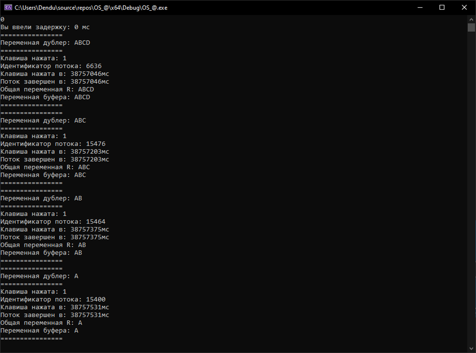
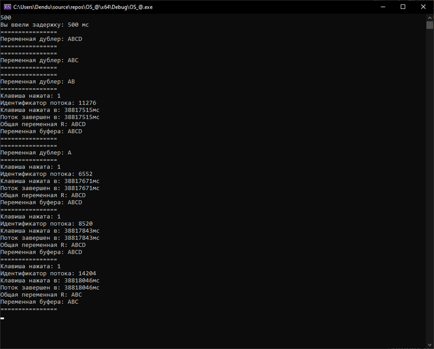

## Lab Work #2: Multithreaded Applications in Windows

## Contents
- [Objective](#objective)
- [Task Description](#task-description)
- [Architecture](#architecture)
- [Execution](#execution)
- [Results](#results)

## Objective
Practical study of thread management in Windows using API:
- Thread creation and management
- Shared data handling
- Race condition analysis

## Task Description
**Variant 6b**  
```plaintext
Initial data: R = "ABCDE"
Operation 1: Append character (when letters are entered)
Operation 2: Remove N characters (when digits 1-9 are entered)
```

## Architecture
### Core functions
```c++
// Character appending
DWORD WINAPI addSymbol(LPVOID lpParam) {
    string buffer = R;
    buffer += static_cast<char>(input_code);
    Sleep(delay_ms);
    R = buffer;
}

// Character removal
DWORD WINAPI deleteSymbol(LPVOID lpParam) {
    string buffer = R;
    buffer.erase(buffer.end() - (input_code - '0'), buffer.end());
    Sleep(delay_ms);
    R = buffer;
}
```

## Execution
1. Compilation: 
``` ``g++ main.cpp -o app.exe -luser32 -lkernel32```
2. Running: 
- Without delay: ```./app.exe 0```
- With 500ms delay: ```./app.exe 500```

## Results
### Zero delay example

### 500 ms example



| Parameter | 0 ms | 500 ms |
|----------------|-------:|:------:|
| Value R | ABCDE | A |
| Rc value | ABCDE | ABC | |
| Compliance | ✓ | ✗ |

    With 500ms delay, a race condition occurs: threads overwrite changes to variable R, resulting in incorrect output (R = "A" instead of expected R = "ABC"). This clearly demonstrates the need for synchronization when accessing shared resources.