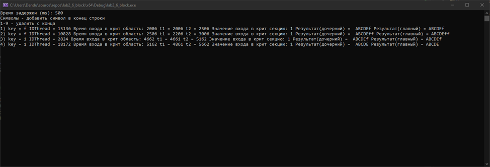
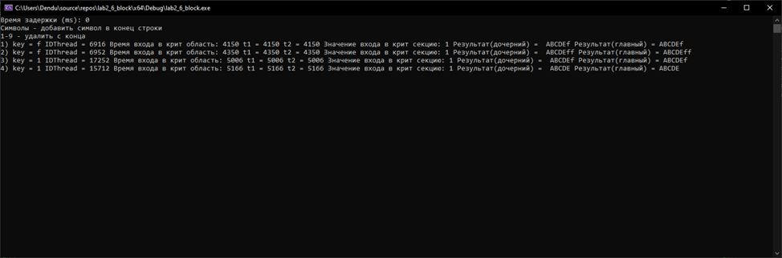

## Lab Work #3: Thread Synchronization in Windows

## Contents
- [Objective](#objective)
- [Task Description](#task-description)
- [Key Improvements](#key-improvements)
- [Architecture](#architecture)
- [Execution](#execution)
- [Results](#results)
- [Analysis](#analysis)

## Objective
Implementation of thread synchronization mechanisms in Windows to:
- Prevent race conditions
- Ensure thread-safe access to shared resources
- Demonstrate proper critical section management

## Task Description
**Variant 6b**  
```
plaintext
Initial data: R = "ABCDE"
Operation 1: Append character (letter input)
Operation 2: Remove N characters (digit 1-9 input)
```

## Key Improvements
Added InterlockedCompareExchange for atomic operations
Implemented proper critical sections
Enhanced logging system
Introduced thread suspension/resume control

## Architecture
### Core Synchronization Mechanism.
```c++
// Atomic lock variable
LONG volatile keyLocked = 0;

// Critical section entry
while (InterlockedCompareExchange(&keyLocked, 1, 0) == 1) {}

// Critical section exit
InterlockedExchange(&keyLocked, 0);
```

## Execution
1. Compilation: 
``` ``g++ main.cpp -o app_sync.exe -luser32 -lkernel32```
2. Running: 
- Without delay: ```./app_sync.exe 0```
- With 500ms delay: ```./app_sync.exe 500```

## Results
### Zero delay example

### 500 ms example


### Analysis

| Criterion          | Lab #2 (No Synchronization) | Lab #3 (With Synchronization) |
|--------------------|----------------------------|------------------------------|
| Data Correctness   | Not guaranteed             | Guaranteed                   |
| Performance        | High                       | Moderate                     |
| Resource Usage     | Low                        | Medium                       |
| System Stability   | Unstable                   | Predictable                  |
| Debug Complexity   | High                       | Medium                       |

    This lab implemented thread synchronization in Windows using atomic operations. The solution prevents data races, ensuring consistent results between threads at the cost of slightly reduced performance. The modified program now works predictably, demonstrating proper thread-safe resource sharing.   